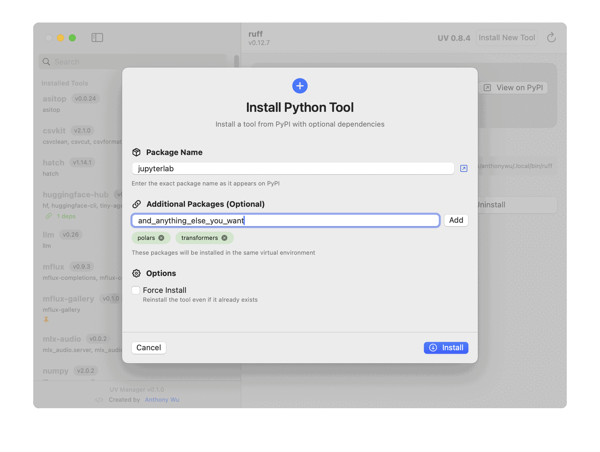

# UV Manager

A macOS app that provides a beautiful SwiftUI interface for managing Python tools via Astral's excellent `uv` tool.



## Status

Alpha release. It should mostly work and do no harm, however the community is invited to co-test this with me. Please file issues in the official repo

## Download

In this repo's [Releases](https://github.com/anthonywu/swift-uv-manager/releases) page I will post notarized direct-download builds as a `.zip` artifact.

Unzip the download and move `UV Manager.app` to your `/Applications` folder. The release process below signs the app with a `Developer ID Application` certificate, submits it for notarization, and staples the notarization ticket so users do not need to disable Gatekeeper or strip the quarantine attribute manually.

## What Users Should Expect

- Download `UV Manager.zip`, unzip it, move `UV Manager.app` to `/Applications`, and open it normally.
- macOS may still show the standard first-launch confirmation for apps downloaded from the internet. This is expected.
- Users should not need to disable Gatekeeper, remove the quarantine attribute manually, or use Terminal just to launch the app.
- On first launch, the app may take a moment while it checks for an existing `uv` installation.
- If `uv` is not installed, the app may offer to install it.
- Installing, upgrading, or removing tools requires network access and may take some time depending on package size and connection speed.
- Tool installs are intended to be user-level operations and should not normally require administrator access.
- This is still an alpha release, so users should expect some rough edges and should report issues if installs, upgrades, or tool detection behave unexpectedly.

## Why UV Manager Exists

The Python ecosystem has created incredibly powerful command-line tools, but there's a CLI barrier between these tools and the many users who could benefit from them.

**The Problem**: Python users—data analysts, data scientists, business users, and hobbyists—need Python tools but lack the software engineering background to comfortably navigate command-line interfaces, virtual environments, and package management. They shouldn't need to understand the intricacies of `pip`, `venv`, or `PATH` configurations just to use a CLI or script that they received from a teammate.

**The Solution**: UV Manager bridges this gap by providing a native macOS interface that makes Python tool management as simple as using any other Mac application. No terminal commands, no environment confusion, no cryptic error messages—just click to install, upgrade, or remove the Python tools you need.

## Who This Helps

- **Data Analysts & Scientists** who want to use tools like Jupyter, pandas utilities, or data converters without wrestling with package conflicts
- **Business Users** who need Python-based reporting or automation tools but aren't comfortable with terminal commands
- **Educators & Students** learning Python who can focus on using tools rather than managing installations
- **Casual Hobbyists** exploring Python tools for personal projects without the overhead of learning package management
- **Mac Users** who expect the polish and simplicity of native applications, not command-line interfaces

By wrapping the powerful UV package manager in an intuitive GUI, UV Manager expands inclusivity users beyond software engineers, making thousands of command-line tools accessible to users who would otherwise never discover or use them.

## Features

- **UV Detection & Management**: Automatically detects UV installations and allows version selection
- **Tool Management**: Install, upgrade, and uninstall Python tools with a native macOS interface
- **Live Terminal Output**: See real-time command execution with syntax highlighting
- **Bulk Operations**: Upgrade all tools at once with safety warnings
- **PyPI Integration**: Quick links to view packages on PyPI
- **Accessibility**: Full VoiceOver support and keyboard navigation
- **Apple HIG Compliance**: Native macOS design with smooth animations

## Requirements

- macOS 14.0 or later
- UV command-line tool (app will offer to install if missing) - pending verification this works
- Xcode with the Metal Toolchain component installed for release builds

## Building

1. Open the package in Xcode
2. Build and run (`⌘R`)

## Direct Distribution Release Setup

These are the one-time local setup steps for producing a signed and notarized direct-download release outside the Mac App Store.

1. Create a `Developer ID Application` certificate in Apple Developer.
2. Generate the CSR on this Mac in `Keychain Access > Certificate Assistant > Request a Certificate From a Certificate Authority...`.
3. Download the issued `.cer` file from Apple and add it to the `login` keychain.
4. Confirm the signing identity is available locally:

```bash
security find-identity -v -p codesigning | rg 'Developer ID Application|TEAMID'
```

5. Install the Xcode Metal Toolchain component:

```bash
xcodebuild -downloadComponent MetalToolchain
xcodebuild -showComponent MetalToolchain -json
```

6. Create an Apple app-specific password at [account.apple.com](https://account.apple.com).
7. Store notarization credentials in the local keychain:

```bash
xcrun notarytool store-credentials YOUR_NOTARY_PROFILE \
  --apple-id "YOUR_APPLE_ID" \
  --team-id "YOUR_TEAM_ID" \
  --password "YOUR_APP_SPECIFIC_PASSWORD"
```

8. Verify the notarization profile works:

```bash
xcrun notarytool history --keychain-profile YOUR_NOTARY_PROFILE
```

## Build And Notarize A Release

Run the release script with the local signing identity and stored notarization profile:

```bash
DEVELOPER_ID_APP='Developer ID Application: Your Name (TEAMID)' \
NOTARY_KEYCHAIN_PROFILE=YOUR_NOTARY_PROFILE \
./build_release.sh
```

The script will:

- build a universal Release app
- sign the app with the `Developer ID Application` certificate
- submit the ZIP archive for notarization with `notarytool`
- staple the notarization ticket to the app
- rebuild the final ZIP for distribution

Artifacts are written to:

- `release/UV Manager.app`
- `release/UV Manager.zip`

## Architecture

- **SwiftUI + MVVM**: Modern declarative UI with observable view models
- **Process/NSTask**: Safe execution of UV commands
- **Async/await**: Clean asynchronous operations
- **Combine**: Reactive data flow

## Target Audience

Software engineering adjacent Python users who may not understand software packaging:
- Data Analysts
- Data Scientists
- Business Users
- Casual hobbyists

The goal is to make Python tools accessible to a broader audience than software engineers and Python developers.

## License

MIT
